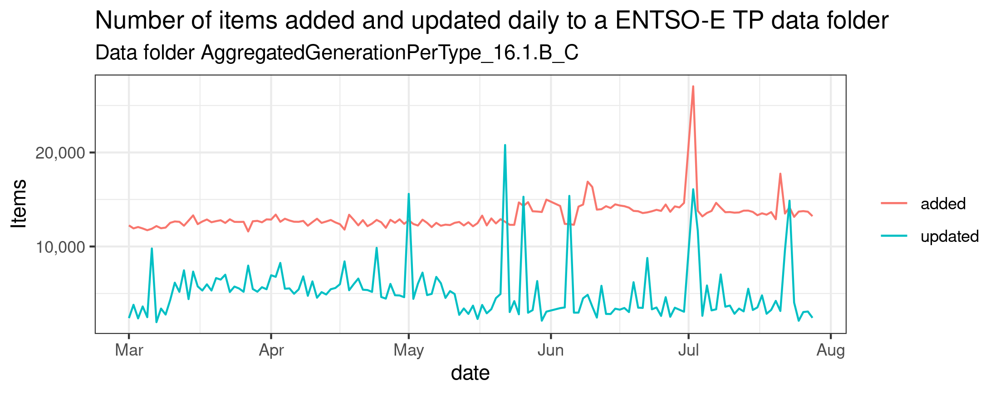

# ENTSO-E Transparency Platform Survival Kit

[ENTSO-E Transparency Platform](https://transparency.entsoe.eu/) (TP) is probably the most important source of information for people analysing European power systems. The platform, designed to comply with the [Regulation (EU) No 543/2013](https://eur-lex.europa.eu/LexUriServ/LexUriServ.do?uri=OJ:L:2013:163:0001:0012:EN:PDF), offers more than 170 GB of data on every aspect of power systems: generation, prices, exchanges, etc.

The platform has been created with the aim of providing timely information to markets and not to provide a consistent and reliable source of information for analysts and scientists. [Lion Hirth et al.](https://www.sciencedirect.com/science/article/pii/S0306261918306068) summarised in 2018 the advantages and the shortcomings of the platform.

The data on the TP is constantly updated and the repository accessible via [SFTP](https://transparency.entsoe.eu/content/static_content/Static%20content/knowledge%20base/SFTP-Transparency_Docs.html) is regenerated every day without any metadata on the changes. In fact, every day not only the new data for the previous 24 is added but also data for other periods is added **and modified**.

For example, the 17/02/2021 at 16:45 the generation from `Fossil Gas` in the Netherlands (NL) was reported (two hours after) as 3785 MW. The day after (18/02/2021) this value changed to 6080 MW, the 19/02/2021 became 6660 MW. One month later, the 17/03/2021, the same value was reported as 7896 MW, becoming again one week later (24/03/2021), 7893 MW. Finally, at the end of the year, this value became 9200 MW and since then it has never changed. 

In other words, the TP is probably the most important source of information to understand and analyse the European power systems but dealing with its "volatility" can be challenging, especially for scientific purposes. 

In this repository I will show two things:
  1. How to batch download the data from the TP and convert the CSVs to a format faster-to-read
  2. Some statistics on how the data can change in a dataset contained in the TP

## Batch download

With the bash script `download_sftp.sh` you can download one or multiple folders from the ENTSO-E TP. For example, I have this script launched by cron every day to download the daily update of the data. 
To use this you need to [register to the TP](https://transparency.entsoe.eu/usrm/user/createPublicUser).

## Conversion from CSV to Feather
[Feather](https://arrow.apache.org/docs/python/feather.html) is a portable file format very fast to read. It is implemented both in Python (`pandas`, `pyarrow`) and R (`arrow`, `feather`) and it is my first choice when saving tabular data. 

The R script `csv_to_feather.R` converts all the CSV files in a folder. 
You can launch this script with the command: `Rscript csv_to_feather.R folder_name/`. 

# An analysis

In this part I will (partially) answer two questions: 
1.   When the data for a generation event is reported?
2.   How many times a generation event is updated?

I have downloaded via SFTP the data in the folder `AggregatedGenerationPerType` for the years 2020-2022 for several months, analysing each day how many data points were added and how many were updated. Here an example of what happened in the last five months:

I have uploaded my current (27/07/2022) snapshot on [Zenodo](https://doi.org/10.5281/zenodo.6939101). It contains 14,587,760 items in this format:

|DateTime   |MapCode |AreaTypeCode |ProductionType   | ActualGenerationOutput|UpdateTime          |ResolutionCode | ActualConsumption|id                             |
|:----------|:-------|:------------|:----------------|----------------------:|:-------------------|:--------------|-----------------:|:------------------------------|
|2020-01-01 |AT      |CTY          |Biomass          |                 208.00|2020-01-01 02:17:40 |PT15M          |                 0|1577836800-AT-Biomass          |
|2020-01-01 |AT      |CTY          |Fossil Gas       |                1797.60|2020-04-01 03:46:12 |PT15M          |                 0|1577836800-AT-Fossil Gas       |
|2020-01-01 |AT      |CTY          |Fossil Gas       |                1762.40|2022-02-17 15:16:10 |PT15M          |                 0|1577836800-AT-Fossil Gas       |
|2020-01-01 |AT      |CTY          |Fossil Hard coal |                 160.00|2020-01-03 11:20:16 |PT15M          |                 0|1577836800-AT-Fossil Hard coal |
|2020-01-01 |AT      |CTY          |Fossil Oil       |                   0.00|2020-01-01 02:17:41 |PT15M          |                 0|1577836800-AT-Fossil Oil       |
|2020-01-01 |AT      |CTY          |Geothermal       |                   0.07|2020-01-01 02:17:39 |PT15M          |                 0|1577836800-AT-Geothermal       |

Each row/item represents a power generation event in the country area defined by `MapCode` happening at the timestamp `DateTime` and added to the Transparency Platform at `UpdateTime`. The dataset I have shared not only contains the data reported by the TP, but also all the thousands of changes that happens every day.

## How the data is updated

In this dataset - and in general in the entire TP - there are more items (i.e., rows) referring to the same event, for example:

|DateTime            |MapCode |AreaTypeCode |ProductionType | ActualGenerationOutput|UpdateTime          |ResolutionCode | ActualConsumption|id                  |
|:-------------------|:-------|:------------|:--------------|----------------------:|:-------------------|:--------------|-----------------:|:-------------------|
|2021-04-04 10:00:00 |PT      |CTY          |Solar          |                  548.6|2021-04-06 19:21:24 |PT60M          |                NA|1617530400-PT-Solar |
|2021-04-04 10:00:00 |PT      |CTY          |Solar          |                  548.7|2021-04-12 06:53:42 |PT60M          |                NA|1617530400-PT-Solar |
|2021-04-04 10:00:00 |PT      |CTY          |Solar          |                  537.2|2021-04-18 12:51:40 |PT60M          |                NA|1617530400-PT-Solar |
|2021-04-04 10:00:00 |PT      |CTY          |Solar          |                  537.3|2021-04-25 22:57:33 |PT60M          |                NA|1617530400-PT-Solar |
|2021-04-04 10:00:00 |PT      |CTY          |Solar          |                  536.7|2021-05-03 05:03:56 |PT60M          |                NA|1617530400-PT-Solar |
|2021-04-04 10:00:00 |PT      |CTY          |Solar          |                  535.3|2021-05-15 20:56:27 |PT60M          |                NA|1617530400-PT-Solar |

In this example, we can see how the generation event for solar power in Portugal the 04/04/2021 is reported multiple times, each time with a different generation value. 

We might expect that the `UpdateTime` (when the data item has been added to the TP) is close to  `DateTime` (the timestamp of the generation) but actually only the 67.4% of the data in this table has a lag between `DateTime` and `UpdateTime` shorter than 24 hours. The 9.4% is in the range from one day to one week and the 19.4% in the range from one week to one year. This means that the 3.7% of the items have an update time longer than one year, here some examples:
|DateTime   |ResolutionCode |AreaTypeCode |MapCode |ProductionType | ActualGenerationOutput| ActualConsumption|UpdateTime          |       lag|
|:----------|:--------------|:------------|:-------|:--------------|----------------------:|-----------------:|:-------------------|---------:|
|2020-01-01 |PT15M          |CTY          |DE      |Geothermal     |                  30.01|                NA|2021-02-10 14:23:51 |  9758.397|
|2020-01-01 |PT60M          |CTY          |EE      |Solar          |                   0.10|                NA|2021-03-16 10:46:06 | 10570.768|
|2020-01-01 |PT15M          |CTY          |NL      |Fossil Gas     |                6215.52|           1436.66|2021-06-01 09:23:05 | 12417.385|
|2020-01-01 |PT15M          |CTY          |NL      |Other          |                1946.09|            552.82|2021-06-01 09:23:12 | 12417.387|
|2020-01-01 |PT15M          |CTY          |NL      |Waste          |                 443.79|              0.00|2021-06-01 09:28:43 | 12417.479|
|2020-01-01 |PT15M          |CTY          |NL      |Wind Offshore  |                 106.79|              0.00|2021-06-01 09:28:46 | 12417.479|

> :warning: To ensure the reproducibility of any calculation/analysis based on the TP data you should always share the dataset you have used. There is **no guarantee** that the underlying data will not change in the future.

# How many times? 

The majority (81.7%) of the power generation events (defined as an unique combination of `DateTime`, `MapCode`, `ProductionType`) appears only one time in this table: it means that they have been added once and never updated. The 12.8% have been updated once and the 3.5% twice. Thus, the 2.1% of the events have been updated **at least** three times, and in this group there are some extremes: one event has been updated 22 times, 5 events 21 times, 13 events 20 times. 
